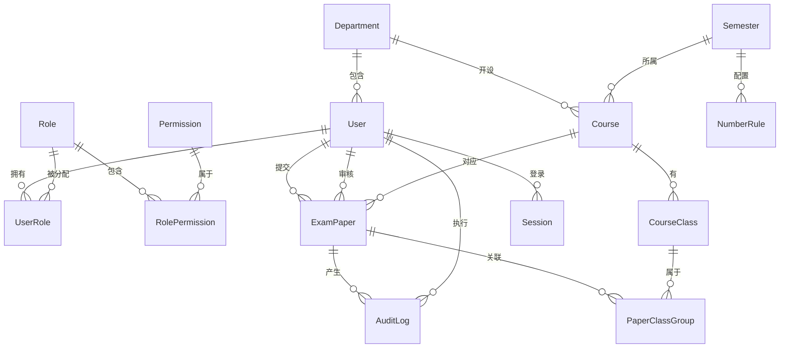
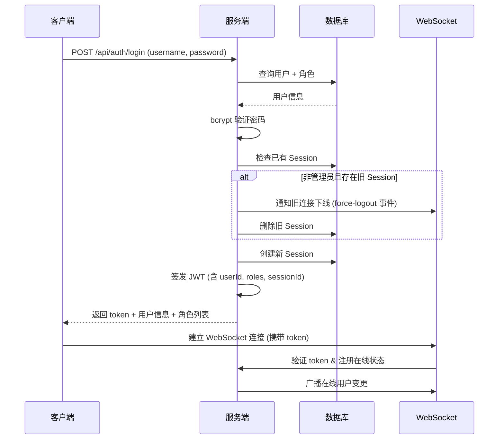
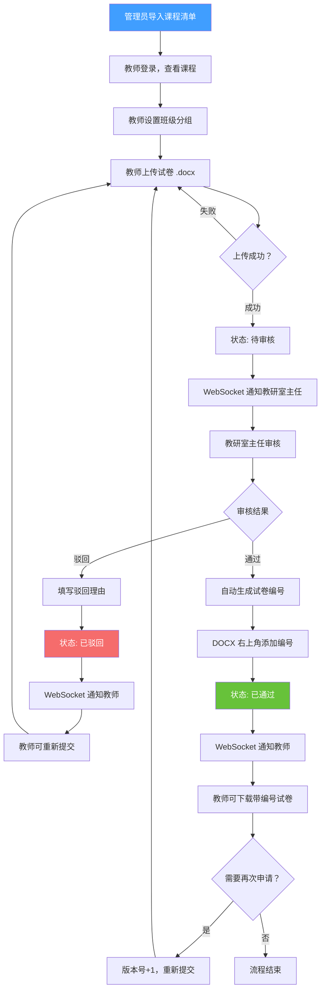

# 试卷工作流系统 - 完整开发方案

## 一、项目概述

### 1.1 项目背景

试卷工作流系统是一套面向高校教务管理的全栈 Web 应用，旨在实现**试卷从出题 → 提交 → 审核 → 编号 → 归档**的全流程数字化管理。系统涵盖课程管理、试卷审批、编号生成、数据导出及实时状态监控等核心功能。

### 1.2 核心价值

| 维度 | 描述 |
|------|------|
| **流程标准化** | 统一试卷提交与审批流程，杜绝纸质流转的低效与丢失风险 |
| **实时可视化** | 管理员/教研室主任实时掌握全局/本组进度，便于调配与催办 |
| **可追溯性** | 完整的审计日志 + 版本记录，满足教学管理与质量评估需求 |
| **安全可控** | 单端登录、角色权限、操作审计三重安全保障 |

---

## 二、技术架构

### 2.1 整体架构图

```
┌──────────────────────────────────────────────────────────┐
│                      客户端 (Browser)                      │
│  Vue 3 + TypeScript + Element Plus + Pinia + Socket.IO    │
└───────────────────────┬──────────────────────────────────┘
                        │ HTTP / WebSocket
┌───────────────────────┴──────────────────────────────────┐
│                    Nginx 反向代理                          │
└───────────┬─────────────────────┬────────────────────────┘
            │ REST API            │ WS
┌───────────┴─────────────────────┴────────────────────────┐
│                   Node.js 后端服务                         │
│  Express + TypeScript + Prisma ORM + Socket.IO Server     │
│  ┌──────────┬──────────┬──────────┬──────────┐           │
│  │ 路由层   │中间件层  │ 服务层   │ 工具层   │           │
│  │ Routes   │Middleware│Services  │ Utils    │           │
│  └──────────┴──────────┴──────────┴──────────┘           │
└───────────────────────┬──────────────────────────────────┘
                        │
┌───────────────────────┴──────────────────────────────────┐
│                   SQLite 数据库                            │
│              (Prisma ORM 统一管理)                         │
└──────────────────────────────────────────────────────────┘
```

### 2.2 技术栈选型

#### 前端

| 技术 | 版本 | 用途 |
|------|------|------|
| **Vue 3** | ^3.5 | 前端框架（Composition API） |
| **TypeScript** | ^5.x | 类型安全 |
| **Vite** | ^6.x | 构建工具 |
| **Vue Router** | ^4.x | 路由管理 |
| **Pinia** | ^2.x | 状态管理 |
| **Element Plus** | ^2.9 | UI 组件库 |
| **Socket.IO Client** | ^4.x | WebSocket 客户端 |
| **Axios** | ^1.x | HTTP 客户端 |
| **xlsx / file-saver** | latest | Excel 导入/导出 |
| **ECharts** | ^5.x | 数据可视化图表 |

#### 后端

| 技术 | 版本 | 用途 |
|------|------|------|
| **Node.js** | ^20 LTS | 运行时 |
| **Express** | ^4.x | Web 框架 |
| **TypeScript** | ^5.x | 类型安全 |
| **Prisma** | ^6.x | ORM & 数据库迁移 |
| **SQLite** | - | 数据库（通过 Prisma 驱动） |
| **Socket.IO** | ^4.x | WebSocket 服务端 |
| **jsonwebtoken** | ^9.x | JWT 认证 |
| **bcryptjs** | ^2.x | 密码加密 |
| **multer** | ^1.x | 文件上传中间件 |
| **docx** | ^9.x | DOCX 文件读写（加水印/编号） |
| **winston** | ^3.x | 日志框架 |
| **node-cron** | ^3.x | 定时任务 |
| **exceljs** | ^4.x | Excel 导入/导出 |
| **zod** | ^3.x | 请求参数校验 |

### 2.3 项目结构

```
exam-workflow-system/
├── package.json                   # Monorepo 根配置
├── packages/
│   ├── client/                    # 前端项目
│   │   ├── public/
│   │   ├── src/
│   │   │   ├── api/               # API 接口封装
│   │   │   ├── assets/            # 静态资源
│   │   │   ├── components/        # 公共组件
│   │   │   │   ├── layout/        # 布局组件
│   │   │   │   ├── common/        # 通用组件
│   │   │   │   └── business/      # 业务组件
│   │   │   ├── composables/       # 组合式函数
│   │   │   ├── directives/        # 自定义指令
│   │   │   ├── hooks/             # 自定义 Hooks
│   │   │   ├── router/            # 路由配置
│   │   │   ├── stores/            # Pinia 状态管理
│   │   │   ├── styles/            # 全局样式 & 主题
│   │   │   ├── types/             # TypeScript 类型定义
│   │   │   ├── utils/             # 工具函数
│   │   │   ├── views/             # 页面视图
│   │   │   │   ├── admin/         # 管理员页面
│   │   │   │   ├── teacher/       # 教师页面
│   │   │   │   ├── director/      # 教研室主任页面
│   │   │   │   └── common/        # 公共页面（登录等）
│   │   │   ├── App.vue
│   │   │   └── main.ts
│   │   ├── index.html
│   │   ├── vite.config.ts
│   │   └── tsconfig.json
│   │
│   ├── server/                    # 后端项目
│   │   ├── prisma/
│   │   │   ├── schema.prisma      # 数据库模型
│   │   │   ├── migrations/        # 迁移文件
│   │   │   └── seed.ts            # 种子数据
│   │   ├── src/
│   │   │   ├── config/            # 配置文件
│   │   │   ├── controllers/       # 控制器
│   │   │   ├── middlewares/       # 中间件
│   │   │   │   ├── auth.ts        # JWT 认证
│   │   │   │   ├── rbac.ts        # 角色权限
│   │   │   │   ├── audit.ts       # 审计日志
│   │   │   │   ├── upload.ts      # 文件上传
│   │   │   │   └── validator.ts   # 参数校验
│   │   │   ├── routes/            # 路由定义
│   │   │   ├── services/          # 业务逻辑
│   │   │   ├── socket/            # WebSocket 事件处理
│   │   │   ├── types/             # 类型定义
│   │   │   ├── utils/             # 工具函数
│   │   │   └── app.ts             # 入口文件
│   │   ├── uploads/               # 试卷上传目录
│   │   ├── tsconfig.json
│   │   └── package.json
│   │
│   └── shared/                    # 前后端共享代码
│       ├── types/                 # 共享类型定义
│       │   ├── api.ts             # API 接口类型
│       │   ├── models.ts          # 数据模型类型
│       │   ├── enums.ts           # 枚举定义
│       │   └── socket.ts          # Socket 事件类型
│       └── constants/             # 共享常量
│           ├── roles.ts
│           └── status.ts
```

---

## 三、数据库设计

### 3.1 ER 关系图



### 3.2 核心表设计

#### 用户与权限

```sql
-- 用户表
CREATE TABLE User (
  id            TEXT PRIMARY KEY DEFAULT (lower(hex(randomblob(16)))),
  username      TEXT NOT NULL UNIQUE,            -- 登录名
  password      TEXT NOT NULL,                   -- bcrypt 加密
  realName      TEXT NOT NULL,                   -- 真实姓名
  email         TEXT,                            -- 邮箱
  phone         TEXT,                            -- 手机号
  departmentId  TEXT REFERENCES Department(id),  -- 所属教研室
  avatar        TEXT,                            -- 头像
  status        INTEGER DEFAULT 1,               -- 1-启用 0-禁用
  lastLoginAt   DATETIME,                        -- 最后登录时间
  lastLoginIp   TEXT,                            -- 最后登录IP
  createdAt     DATETIME DEFAULT CURRENT_TIMESTAMP,
  updatedAt     DATETIME DEFAULT CURRENT_TIMESTAMP
);

-- 角色表
CREATE TABLE Role (
  id          TEXT PRIMARY KEY DEFAULT (lower(hex(randomblob(16)))),
  code        TEXT NOT NULL UNIQUE,  -- admin / director / teacher
  name        TEXT NOT NULL,         -- 管理员 / 教研室主任 / 教师
  description TEXT,
  sortOrder   INTEGER DEFAULT 0,
  status      INTEGER DEFAULT 1,
  createdAt   DATETIME DEFAULT CURRENT_TIMESTAMP
);

-- 用户-角色关联表
CREATE TABLE UserRole (
  userId TEXT NOT NULL REFERENCES User(id) ON DELETE CASCADE,
  roleId TEXT NOT NULL REFERENCES Role(id) ON DELETE CASCADE,
  PRIMARY KEY (userId, roleId)
);

-- 权限表
CREATE TABLE Permission (
  id          TEXT PRIMARY KEY DEFAULT (lower(hex(randomblob(16)))),
  code        TEXT NOT NULL UNIQUE,  -- user:create, paper:approve 等
  name        TEXT NOT NULL,         -- 中文权限名
  module      TEXT NOT NULL,         -- 所属模块
  description TEXT,
  createdAt   DATETIME DEFAULT CURRENT_TIMESTAMP
);

-- 角色-权限关联表
CREATE TABLE RolePermission (
  roleId       TEXT NOT NULL REFERENCES Role(id) ON DELETE CASCADE,
  permissionId TEXT NOT NULL REFERENCES Permission(id) ON DELETE CASCADE,
  PRIMARY KEY (roleId, permissionId)
);
```

#### 学期与课程

```sql
-- 学期表
CREATE TABLE Semester (
  id         TEXT PRIMARY KEY DEFAULT (lower(hex(randomblob(16)))),
  name       TEXT NOT NULL UNIQUE,   -- 如 "2025-2026 第一学期"
  code       TEXT NOT NULL UNIQUE,   -- 如 "2025-2026-1"
  startDate  DATE NOT NULL,
  endDate    DATE NOT NULL,
  isCurrent  INTEGER DEFAULT 0,      -- 是否当前学期
  status     INTEGER DEFAULT 1,      -- 1-启用 0-归档
  createdAt  DATETIME DEFAULT CURRENT_TIMESTAMP,
  updatedAt  DATETIME DEFAULT CURRENT_TIMESTAMP
);

-- 教研室表
CREATE TABLE Department (
  id          TEXT PRIMARY KEY DEFAULT (lower(hex(randomblob(16)))),
  name        TEXT NOT NULL UNIQUE,
  code        TEXT NOT NULL UNIQUE,
  description TEXT,
  directorId  TEXT REFERENCES User(id), -- 教研室主任
  sortOrder   INTEGER DEFAULT 0,
  status      INTEGER DEFAULT 1,
  createdAt   DATETIME DEFAULT CURRENT_TIMESTAMP,
  updatedAt   DATETIME DEFAULT CURRENT_TIMESTAMP
);

-- 课程表
CREATE TABLE Course (
  id           TEXT PRIMARY KEY DEFAULT (lower(hex(randomblob(16)))),
  semesterId   TEXT NOT NULL REFERENCES Semester(id),
  courseCode   TEXT NOT NULL,            -- 课程编号
  courseName   TEXT NOT NULL,            -- 课程名
  teacherId    TEXT NOT NULL REFERENCES User(id),  -- 任课教师
  departmentId TEXT NOT NULL REFERENCES Department(id),
  creditHours  REAL,                     -- 学分
  courseType   TEXT,                      -- 课程类型（必修/选修等）
  createdAt    DATETIME DEFAULT CURRENT_TIMESTAMP,
  updatedAt    DATETIME DEFAULT CURRENT_TIMESTAMP,
  UNIQUE(semesterId, courseCode, teacherId) -- 同学期同课程同教师唯一
);

-- 课程-班级表
CREATE TABLE CourseClass (
  id         TEXT PRIMARY KEY DEFAULT (lower(hex(randomblob(16)))),
  courseId   TEXT NOT NULL REFERENCES Course(id) ON DELETE CASCADE,
  className  TEXT NOT NULL,  -- 班级名称
  createdAt  DATETIME DEFAULT CURRENT_TIMESTAMP
);
```

#### 试卷工作流

```sql
-- 试卷申请表
CREATE TABLE ExamPaper (
  id               TEXT PRIMARY KEY DEFAULT (lower(hex(randomblob(16)))),
  courseId          TEXT NOT NULL REFERENCES Course(id),
  teacherId        TEXT NOT NULL REFERENCES User(id),
  semesterId       TEXT NOT NULL REFERENCES Semester(id),
  version          INTEGER DEFAULT 1,             -- 版本号（再次申请+1）
  originalFileName TEXT NOT NULL,                 -- 原始文件名
  originalFilePath TEXT NOT NULL,                 -- 原始文件存储路径
  approvedFilePath TEXT,                          -- 审批后文件路径（含编号）
  paperNumber      TEXT UNIQUE,                   -- 试卷编号（审批后生成）
  status           TEXT NOT NULL DEFAULT 'pending',
    -- pending:待审核 / approved:已通过 / rejected:已驳回
  rejectReason     TEXT,                          -- 驳回理由
  reviewerId       TEXT REFERENCES User(id),      -- 审核人（教研室主任）
  reviewedAt       DATETIME,                      -- 审核时间
  submittedAt      DATETIME DEFAULT CURRENT_TIMESTAMP,
  createdAt        DATETIME DEFAULT CURRENT_TIMESTAMP,
  updatedAt        DATETIME DEFAULT CURRENT_TIMESTAMP
);

-- 试卷-班级分组（共用试卷的班级组）
CREATE TABLE PaperClassGroup (
  paperId      TEXT NOT NULL REFERENCES ExamPaper(id) ON DELETE CASCADE,
  courseClassId TEXT NOT NULL REFERENCES CourseClass(id),
  PRIMARY KEY (paperId, courseClassId)
);

-- 试卷编号规则
CREATE TABLE NumberRule (
  id          TEXT PRIMARY KEY DEFAULT (lower(hex(randomblob(16)))),
  semesterId  TEXT NOT NULL REFERENCES Semester(id),
  prefix      TEXT NOT NULL DEFAULT 'SJ',    -- 前缀，如 "SJ"
  separator   TEXT NOT NULL DEFAULT '-',     -- 分隔符
  dateFormat  TEXT DEFAULT 'YYYYMM',         -- 日期格式部分
  seqLength   INTEGER DEFAULT 4,             -- 序号位数
  currentSeq  INTEGER DEFAULT 0,             -- 当前序号
  example     TEXT,                          -- 示例：SJ-202601-0001
  description TEXT,
  createdAt   DATETIME DEFAULT CURRENT_TIMESTAMP,
  updatedAt   DATETIME DEFAULT CURRENT_TIMESTAMP,
  UNIQUE(semesterId)
);
```

#### 系统管理

```sql
-- 会话表（用于单端登录控制）
CREATE TABLE Session (
  id          TEXT PRIMARY KEY DEFAULT (lower(hex(randomblob(16)))),
  userId      TEXT NOT NULL REFERENCES User(id) ON DELETE CASCADE,
  token       TEXT NOT NULL UNIQUE,
  socketId    TEXT,                           -- 对应的 Socket.IO 连接 ID
  currentRole TEXT,                           -- 当前激活的角色 code
  ipAddress   TEXT,
  userAgent   TEXT,
  isOnline    INTEGER DEFAULT 1,
  lastActiveAt DATETIME DEFAULT CURRENT_TIMESTAMP,
  expiresAt   DATETIME NOT NULL,
  createdAt   DATETIME DEFAULT CURRENT_TIMESTAMP
);

-- 审计日志表
CREATE TABLE AuditLog (
  id          TEXT PRIMARY KEY DEFAULT (lower(hex(randomblob(16)))),
  userId      TEXT REFERENCES User(id),
  userName    TEXT NOT NULL,                  -- 冗余存储，防止用户删除后丢失
  action      TEXT NOT NULL,                 -- 操作动作
  module      TEXT NOT NULL,                 -- 操作模块
  target      TEXT,                          -- 操作对象
  detail      TEXT NOT NULL,                 -- 中文描述详情
  ipAddress   TEXT,
  userAgent   TEXT,
  statusCode  INTEGER,                       -- 操作结果状态码
  createdAt   DATETIME DEFAULT CURRENT_TIMESTAMP
);

-- 系统配置表
CREATE TABLE SystemConfig (
  key         TEXT PRIMARY KEY,
  value       TEXT NOT NULL,
  description TEXT,
  updatedAt   DATETIME DEFAULT CURRENT_TIMESTAMP
);
```

---

## 四、核心功能模块设计

### 4.1 用户认证与权限

#### 认证流程



#### JWT Payload 设计

```typescript
interface JwtPayload {
  userId: string;
  sessionId: string;
  roles: string[];        // 用户的所有角色 code
  currentRole: string;    // 当前激活角色
  departmentId?: string;
  iat: number;
  exp: number;
}
```

#### 角色切换

- 前端提供角色切换下拉菜单
- 切换时调用 `POST /api/auth/switch-role`
- 服务端更新 Session 中的 `currentRole`，签发新 JWT
- 通过 WebSocket 通知客户端刷新 token
- 前端根据新角色动态切换菜单和路由

#### 权限控制

```typescript
// 权限中间件
const requirePermission = (...permissions: string[]) => {
  return async (req: Request, res: Response, next: NextFunction) => {
    const userPermissions = await getUserPermissions(req.user.userId, req.user.currentRole);
    const hasPermission = permissions.some(p => userPermissions.includes(p));
    if (!hasPermission) {
      throw new ForbiddenError('无权执行此操作');
    }
    next();
  };
};

// 使用示例
router.post('/users', requirePermission('user:create'), userController.create);
```

#### 前端路由守卫

```typescript
// 动态路由 - 根据角色生成不同菜单
const roleRouteMap: Record<string, RouteRecordRaw[]> = {
  admin: [
    { path: '/admin/dashboard', component: AdminDashboard },
    { path: '/admin/users', component: UserManagement },
    { path: '/admin/roles', component: RoleManagement },
    // ...
  ],
  director: [
    { path: '/director/dashboard', component: DirectorDashboard },
    { path: '/director/reviews', component: PaperReview },
    // ...
  ],
  teacher: [
    { path: '/teacher/courses', component: TeacherCourses },
    { path: '/teacher/papers', component: TeacherPapers },
    // ...
  ],
};
```

### 4.2 WebSocket 实时通信

#### Socket.IO 事件设计

```typescript
// 共享类型定义 (packages/shared/types/socket.ts)

// 服务端 → 客户端事件
interface ServerToClientEvents {
  // 在线状态
  'online:update': (data: { onlineUsers: OnlineUser[]; count: number }) => void;
  'online:user-joined': (user: OnlineUser) => void;
  'online:user-left': (userId: string) => void;

  // 试卷状态
  'paper:status-changed': (data: PaperStatusEvent) => void;
  'paper:new-submission': (data: PaperSubmissionEvent) => void;

  // 统计数据
  'stats:update': (data: DashboardStats) => void;

  // 系统通知
  'notification:new': (data: NotificationPayload) => void;

  // 强制下线
  'session:force-logout': (data: { reason: string }) => void;
}

// 客户端 → 服务端事件
interface ClientToServerEvents {
  // 角色切换
  'role:switch': (roleCode: string, callback: (res: SocketResponse) => void) => void;

  // 心跳
  'heartbeat': (callback: () => void) => void;

  // 加入房间（按教研室）
  'room:join': (departmentId: string) => void;
}
```

#### 房间管理策略

```
WebSocket Rooms:
├── global                    # 全局房间（系统公告）
├── role:admin                # 管理员房间
├── role:director             # 教研室主任房间
├── role:teacher              # 教师房间
├── department:{departmentId} # 教研室房间（主任可见本组）
└── user:{userId}             # 个人房间（定点推送）
```

#### 在线状态管理

```typescript
class OnlineManager {
  // 内存中维护在线用户 Map
  private onlineUsers: Map<string, OnlineUserInfo> = new Map();

  // 用户上线
  async userConnect(userId: string, socketId: string, sessionInfo: SessionInfo) {
    this.onlineUsers.set(userId, { socketId, ...sessionInfo, connectedAt: new Date() });
    await this.broadcastOnlineStatus();
  }

  // 用户下线
  async userDisconnect(userId: string) {
    this.onlineUsers.delete(userId);
    await this.updateSessionOffline(userId);
    await this.broadcastOnlineStatus();
  }

  // 广播在线状态（分房间推送）
  async broadcastOnlineStatus() {
    // 管理员：推送全局在线列表
    io.to('role:admin').emit('online:update', this.getAllOnlineUsers());

    // 教研室主任：推送本组在线列表
    for (const [deptId, members] of this.getOnlineByDepartment()) {
      io.to(`department:${deptId}`).emit('online:update', members);
    }
  }
}
```

### 4.3 试卷工作流核心流程

#### 完整流程图



#### 试卷编号生成

```typescript
class PaperNumberService {
  /**
   * 生成试卷编号
   * 规则由管理员在 NumberRule 表中定义
   * 示例模板: {prefix}{separator}{date}{separator}{seq}
   * 示例结果: SJ-202601-0001
   */
  async generateNumber(semesterId: string): Promise<string> {
    // 使用事务确保编号唯一性
    return await prisma.$transaction(async (tx) => {
      const rule = await tx.numberRule.findUnique({
        where: { semesterId }
      });

      if (!rule) throw new Error('未配置编号规则');

      const newSeq = rule.currentSeq + 1;
      const datePart = dayjs().format(rule.dateFormat);
      const seqPart = String(newSeq).padStart(rule.seqLength, '0');
      const number = `${rule.prefix}${rule.separator}${datePart}${rule.separator}${seqPart}`;

      // 更新序号
      await tx.numberRule.update({
        where: { id: rule.id },
        data: { currentSeq: newSeq }
      });

      return number;
    });
  }
}
```

#### DOCX 编号注入

```typescript
import { Document, Packer, Paragraph, TextRun, AlignmentType, Header } from 'docx';
import * as mammoth from 'mammoth';

class DocxService {
  /**
   * 在试卷 DOCX 右上角添加编号
   */
  async addPaperNumber(inputPath: string, outputPath: string, paperNumber: string): Promise<void> {
    // 方案：读取原始文档，在页眉右上角添加编号
    const doc = await this.readDocx(inputPath);

    // 创建包含编号的页眉
    const header = new Header({
      children: [
        new Paragraph({
          alignment: AlignmentType.RIGHT,
          children: [
            new TextRun({
              text: `试卷编号：${paperNumber}`,
              size: 20,  // 10pt
              font: '宋体',
            }),
          ],
        }),
      ],
    });

    // 写入新文件
    const buffer = await Packer.toBuffer(doc);
    await fs.writeFile(outputPath, buffer);
  }
}
```

### 4.4 管理员模块

#### 管理页面清单

| 页面 | 路由 | 核心功能 |
|------|------|----------|
| **仪表盘** | `/admin/dashboard` | 在线用户列表、试卷状态分布图、教研室进度、本学期统计 |
| **用户管理** | `/admin/users` | CRUD、分配角色、启用/禁用、重置密码、批量导入 |
| **角色管理** | `/admin/roles` | CRUD、权限分配 |
| **权限管理** | `/admin/permissions` | 权限列表查看（一般由种子数据预置） |
| **学期管理** | `/admin/semesters` | CRUD、设置当前学期、归档历史学期 |
| **教研室管理** | `/admin/departments` | CRUD、指定教研室主任、成员管理 |
| **课程管理** | `/admin/courses` | Excel 导入/导出、手动 CRUD、按学期筛选 |
| **流程设计** | `/admin/workflow` | 编号规则配置、审批流参数设置 |
| **试卷总览** | `/admin/papers` | 查看全部试卷状态、筛选、导出 |
| **审计日志** | `/admin/audit-logs` | 查看全部操作日志、筛选、导出 |
| **系统设置** | `/admin/settings` | 系统参数配置 |

#### 仪表盘设计

```
┌─────────────────────────────────────────────────────────────┐
│  统计卡片区                                                    │
│  ┌──────────┐ ┌──────────┐ ┌──────────┐ ┌──────────┐       │
│  │ 在线人数  │ │ 待审试卷  │ │ 已通过   │ │ 已驳回   │       │
│  │   12     │ │    8     │ │   135    │ │    3     │       │
│  └──────────┘ └──────────┘ └──────────┘ └──────────┘       │
├─────────────────┬───────────────────────────────────────────┤
│  在线用户列表    │  试卷状态分布饼图                            │
│  ┌─────────┐   │  ┌───────────────────┐                    │
│  │ 张三 🟢  │   │  │                   │                    │
│  │ 教师     │   │  │    [ECharts]      │                    │
│  ├─────────┤   │  │                   │                    │
│  │ 李四 🟢  │   │  └───────────────────┘                    │
│  │ 主任     │   │                                           │
│  └─────────┘   │  各教研室进度条                               │
│                │  ┌───────────────────┐                     │
│                │  │ 计算机教研室 80%  │                      │
│                │  │ 数学教研室   60%   │                     │
│                │  └───────────────────┘                     │
└─────────────────┴───────────────────────────────────────────┘
```

#### 课程 Excel 导入

```typescript
// 期望的 Excel 列结构
interface CourseImportRow {
  courseCode: string;    // 课程编号
  courseName: string;    // 课程名
  teacherName: string;   // 任课教师（关联匹配）
  className: string;     // 上课班级（多个用逗号分隔）
  departmentName: string; // 所属教研室
  creditHours?: number;  // 学分
  courseType?: string;   // 课程类型
}
```

### 4.5 教师模块

| 页面 | 路由 | 核心功能 |
|------|------|----------|
| **我的课程** | `/teacher/courses` | 查看本学期名下课程、班级分组设置 |
| **试卷提交** | `/teacher/papers` | 上传试卷、查看状态、下载审批后试卷 |
| **个人信息** | `/teacher/profile` | 修改个人信息、修改密码 |

### 4.6 教研室主任模块

| 页面 | 路由 | 核心功能 |
|------|------|----------|
| **工作台** | `/director/dashboard` | 本组统计、在线成员、待审数量 |
| **试卷审核** | `/director/reviews` | 审核列表、通过/驳回、查看历史 |
| **本组数据** | `/director/data` | 本组教师课程状态总览、导出 |
| **个人信息** | `/director/profile` | 修改个人信息、修改密码 |

### 4.7 审计日志

#### 日志格式设计（中文可读）

```typescript
// 审计日志模板
const auditTemplates: Record<string, string> = {
  'user:login':       '{userName} 登录了系统（IP: {ip}）',
  'user:logout':      '{userName} 退出了系统',
  'user:create':      '{userName} 创建了用户 [{targetName}]',
  'user:update':      '{userName} 修改了用户 [{targetName}] 的信息',
  'user:delete':      '{userName} 删除了用户 [{targetName}]',
  'role:assign':      '{userName} 为用户 [{targetName}] 分配了角色 [{roleName}]',
  'role:switch':      '{userName} 切换角色为 [{roleName}]',
  'course:import':    '{userName} 导入了 {count} 条课程数据（学期：{semesterName}）',
  'paper:submit':     '{userName} 提交了课程 [{courseName}] 的试卷（版本 {version}）',
  'paper:approve':    '{userName} 审核通过了 [{teacherName}] 的课程 [{courseName}] 试卷，编号: {paperNumber}',
  'paper:reject':     '{userName} 驳回了 [{teacherName}] 的课程 [{courseName}] 试卷，理由: {reason}',
  'paper:download':   '{userName} 下载了课程 [{courseName}] 的试卷（编号: {paperNumber}）',
  'paper:resubmit':   '{userName} 重新提交了课程 [{courseName}] 的试卷（版本 {version}）',
  'semester:create':  '{userName} 创建了学期 [{semesterName}]',
  'department:create': '{userName} 创建了教研室 [{departmentName}]',
  'config:update':    '{userName} 修改了系统配置 [{configKey}]',
  'number-rule:set':  '{userName} 设置了学期 [{semesterName}] 的试卷编号规则',
  'data:export':      '{userName} 导出了 [{exportType}] 数据',
  'session:kick':     '系统自动将 {userName} 的旧会话踢下线（新登录IP: {ip}）',
};
```

---

## 五、API 接口设计

### 5.1 RESTful API 规范

- 基础路径: `/api/v1`
- 认证: `Authorization: Bearer <JWT>`
- 响应格式:

```typescript
// 统一响应格式
interface ApiResponse<T = any> {
  code: number;       // 业务状态码 (0=成功)
  message: string;    // 中文提示信息
  data?: T;
  timestamp: number;
}

// 分页响应
interface PaginatedResponse<T> extends ApiResponse {
  data: {
    list: T[];
    total: number;
    page: number;
    pageSize: number;
  };
}
```

### 5.2 主要接口列表

#### 认证

| 方法 | 路径 | 描述 | 权限 |
|------|------|------|------|
| POST | `/auth/login` | 用户登录 | 公开 |
| POST | `/auth/logout` | 退出登录 | 已登录 |
| POST | `/auth/switch-role` | 切换角色 | 已登录 |
| GET  | `/auth/profile` | 获取当前用户信息 | 已登录 |
| PUT  | `/auth/password` | 修改密码 | 已登录 |

#### 用户管理

| 方法 | 路径 | 描述 | 权限 |
|------|------|------|------|
| GET    | `/users` | 用户列表（分页、筛选） | admin |
| POST   | `/users` | 创建用户 | admin |
| PUT    | `/users/:id` | 更新用户 | admin |
| DELETE | `/users/:id` | 删除用户 | admin |
| POST   | `/users/:id/roles` | 分配角色 | admin |
| POST   | `/users/:id/reset-password` | 重置密码 | admin |
| POST   | `/users/batch-import` | 批量导入用户 | admin |

#### 学期/教研室/课程

| 方法 | 路径 | 描述 | 权限 |
|------|------|------|------|
| GET/POST/PUT/DELETE | `/semesters/*` | 学期 CRUD | admin |
| PUT | `/semesters/:id/set-current` | 设为当前学期 | admin |
| GET/POST/PUT/DELETE | `/departments/*` | 教研室 CRUD | admin |
| GET/POST/PUT/DELETE | `/courses/*` | 课程 CRUD | admin |
| POST | `/courses/import` | Excel 导入课程 | admin |
| GET | `/courses/export` | 导出课程数据 | admin |
| GET | `/courses/my` | 教师查看我的课程 | teacher |

#### 试卷工作流

| 方法 | 路径 | 描述 | 权限 |
|------|------|------|------|
| POST | `/papers/submit` | 提交试卷 | teacher |
| GET  | `/papers/my` | 我的试卷列表 | teacher |
| GET  | `/papers/pending` | 待审核列表 | director |
| POST | `/papers/:id/approve` | 审核通过 | director |
| POST | `/papers/:id/reject` | 驳回试卷 | director |
| GET  | `/papers/:id/download` | 下载试卷 | teacher/director/admin |
| GET  | `/papers/all` | 试卷总览 | admin |
| GET  | `/papers/department/:deptId` | 教研室试卷 | director |
| PUT  | `/papers/:id/class-group` | 设置班级分组 | teacher |

#### 编号规则

| 方法 | 路径 | 描述 | 权限 |
|------|------|------|------|
| GET  | `/number-rules` | 编号规则列表 | admin |
| POST | `/number-rules` | 创建编号规则 | admin |
| PUT  | `/number-rules/:id` | 更新编号规则 | admin |

#### 统计与导出

| 方法 | 路径 | 描述 | 权限 |
|------|------|------|------|
| GET | `/stats/admin` | 管理员仪表盘统计 | admin |
| GET | `/stats/director` | 教研室主任统计 | director |
| GET | `/export/papers` | 导出试卷数据 | admin/director |
| GET | `/export/audit-logs` | 导出审计日志 | admin |

#### 审计日志

| 方法 | 路径 | 描述 | 权限 |
|------|------|------|------|
| GET | `/audit-logs` | 查询审计日志（分页、筛选） | admin |

#### 在线状态

| 方法 | 路径 | 描述 | 权限 |
|------|------|------|------|
| GET | `/online/users` | 获取当前在线用户列表 | admin/director |

---

## 六、安全设计

### 6.1 认证安全

| 措施 | 实现方式 |
|------|----------|
| **密码加密** | bcrypt (saltRounds=12) |
| **JWT 有效期** | Access Token 2小时，可配置 |
| **单端登录** | 非管理员登录时自动踢出已有会话（WebSocket 实时通知） |
| **登录限流** | 同 IP 5分钟内最多尝试 10 次 |
| **Session 管理** | 服务端 Session 表，支持强制下线 |

### 6.2 文件安全

| 措施 | 实现方式 |
|------|----------|
| **文件类型校验** | 仅允许 `.docx`，校验文件 Magic Number |
| **文件大小限制** | 单文件上限 20MB，可配置 |
| **存储路径隔离** | 按学期/教研室/教师分目录存储 |
| **文件名安全** | 使用 UUID 重命名，避免路径遍历 |
| **下载鉴权** | 仅允许试卷相关方（提交人、审核人、管理员）下载 |

### 6.3 接口安全

| 措施 | 实现方式 |
|------|----------|
| **参数校验** | Zod 严格校验请求体 |
| **SQL 注入防护** | Prisma ORM 参数化查询 |
| **XSS 防护** | 输入过滤 + CSP 头 |
| **CORS 配置** | 仅允许指定来源 |
| **请求限流** | express-rate-limit |
| **Helmet** | 安全 HTTP 头 |

---

## 七、我的额外建议（专业化增强）

### 7.1 试卷查重与唯一性保障

- 上传试卷时计算文件 **SHA-256 哈希**，存入数据库
- 同一课程同一版本禁止上传完全相同的文件
- 提供管理员查看文件哈希的能力

### 7.2 操作通知中心

- 新增 `Notification` 表和前端通知铃铛组件
- 审批结果、驳回理由等通过站内通知 + WebSocket 实时推送
- 通知支持已读/未读状态

### 7.3 试卷预览

- 集成 DOCX 在线预览（使用 `mammoth.js` 将 DOCX 转为 HTML 在前端展示）
- 审核人可直接在线预览试卷内容，无需下载

### 7.4 数据备份策略

- SQLite 数据库定时自动备份（`node-cron` 每日凌晨）
- 上传文件增量备份
- 提供管理员手动备份/恢复功能

### 7.5 操作确认与二次验证

- 关键操作（删除用户、批量导入、审批通过）需二次确认弹窗
- 批量操作展示影响范围预览

### 7.6 性能优化

- API 响应缓存（学期列表等静态数据）
- WebSocket 消息节流（批量更新合并推送，100ms 节流）
- SQLite WAL 模式提高并发读性能
- 前端路由懒加载 + 组件按需导入

### 7.7 错误追踪

- 全局错误处理中间件
- 前端全局错误捕获 (`Vue errorHandler`)
- 错误堆栈记录到日志文件（winston, 按日轮转）

### 7.8 国际化预留

- 前端使用 `vue-i18n` 预留国际化能力
- 后端错误消息码与消息分离

---

## 八、UI/UX 设计规范

### 8.1 整体风格

- **色彩方案**: 以 Element Plus 默认主色 `#409EFF` 为主色调，搭配深色侧边栏
- **布局模式**: 经典后台管理布局（左侧菜单 + 顶部导航栏 + 内容区）
- **间距规范**: 使用 Element Plus 内置 spacing（8px 基准）
- **字体**: `'Microsoft YaHei', 'PingFang SC', 'Helvetica Neue', sans-serif`

### 8.2 布局结构

```
┌──────────────────────────────────────────────────────────┐
│  顶部导航栏：Logo | 面包屑 | [ 通知🔔 角色切换 用户菜单 ]  │
├──────────┬───────────────────────────────────────────────┤
│  侧边栏   │  内容区                                      │
│  ┌──────┐│                                              │
│  │ 菜单  ││  ┌──────────────────────────────────────┐   │
│  │      ││  │  页面标题 + 操作按钮                    │   │
│  │ 根据  ││  ├──────────────────────────────────────┤   │
│  │ 角色  ││  │                                      │   │
│  │ 动态  ││  │           页面主体内容                 │   │
│  │ 渲染  ││  │                                      │   │
│  │      ││  │                                      │   │
│  └──────┘│  └──────────────────────────────────────┘   │
└──────────┴───────────────────────────────────────────────┘
```

### 8.3 关键 Element Plus 组件使用

| 场景 | 组件 |
|------|------|
| 数据表格 | `el-table` + `el-pagination` |
| 表单操作 | `el-form` + `el-dialog` |
| 菜单导航 | `el-menu` (侧边栏) |
| 面包屑 | `el-breadcrumb` |
| 状态标签 | `el-tag` (不同颜色表示不同状态) |
| 文件上传 | `el-upload` (限制 docx) |
| 消息提示 | `ElMessage` / `ElNotification` |
| 确认弹窗 | `ElMessageBox.confirm` |
| 统计卡片 | `el-card` + `el-statistic` |
| 进度展示 | `el-progress` |
| 角色切换 | `el-dropdown` |
| 搜索筛选 | `el-select` + `el-date-picker` + `el-input` |

---

## 九、部署方案

### 9.1 开发环境

```bash
# 安装依赖
npm install

# 启动开发服务
npm run dev          # 同时启动前后端 (使用 concurrently)

# 数据库迁移
npm run db:migrate

# 初始化种子数据
npm run db:seed
```

### 9.2 生产部署（宝塔面板）

```
                    ┌─────────────────────┐
                    │    Nginx (80/443)    │
                    │  SSL + 静态资源 +    │
                    │  反向代理            │
                    └──────────┬──────────┘
                               │
            ┌──────────────────┴──────────────────┐
            │                                     │
    ┌───────┴───────┐                    ┌────────┴───────┐
    │ /api → :3200  │                    │  / → dist/     │
    │ Node.js 后端   │                    │  Vue 前端静态   │
    │  (PM2 守护)    │                    │  资源文件       │
    └───────────────┘                    └────────────────┘
```

**Nginx 配置要点：**
- 静态资源指向前端 `dist/` 目录
- `/api` 路径反向代理到 Node.js 服务（3200端口）
- `/socket.io` 路径支持 WebSocket 升级
- 启用 Gzip 压缩
- 配置 SSL 证书

**PM2 后端守护：**
```bash
pm2 start dist/app.js --name exam-workflow -i 1
pm2 save
pm2 startup
```

---

## 十、开发计划与里程碑

### 阶段一：基础架构（预计 2-3 天）
- [ ] Monorepo 初始化 (pnpm workspace)
- [ ] 前后端项目骨架搭建
- [ ] Prisma 数据库模型 + 迁移
- [ ] 种子数据（管理员账号 + 预置角色权限）
- [ ] JWT 认证 + 登录接口
- [ ] 前端登录页 + 路由守卫

### 阶段二：管理模块（预计 3-4 天）
- [ ] 用户 CRUD + 角色分配
- [ ] 学期 / 教研室 / 课程 CRUD
- [ ] 课程 Excel 导入
- [ ] 编号规则配置
- [ ] 审计日志记录 + 查询

### 阶段三：试卷工作流（预计 3-4 天）
- [ ] 教师课程列表 + 班级分组
- [ ] 试卷上传 + 文件存储
- [ ] 教研室主任审核（通过/驳回）
- [ ] 试卷编号生成 + DOCX 注入
- [ ] 再次申请覆盖机制

### 阶段四：实时通信（预计 2-3 天）
- [ ] Socket.IO 集成
- [ ] 在线状态管理
- [ ] 单端登录踢出
- [ ] 实时状态推送（仪表盘/审批状态）
- [ ] 通知中心

### 阶段五：统计与导出（预计 1-2 天）
- [ ] 管理员仪表盘 + ECharts
- [ ] 教研室主任工作台
- [ ] 数据导出（Excel）

### 阶段六：完善与优化（预计 2-3 天）
- [ ] 权限细化测试
- [ ] 前端交互优化
- [ ] 错误处理完善
- [ ] 部署脚本 + 文档

---

## 十一、验证计划

### 自动化验证

```bash
# 后端单元测试
cd packages/server && npm run test

# 前端类型检查
cd packages/client && npm run type-check

# 数据库迁移验证
npx prisma migrate dev --name init
npx prisma db seed
```

### 功能验证（需人工确认）

1. **登录流程**：管理员/教师/主任分别登录，验证角色菜单正确
2. **角色切换**：具有多角色用户切换角色后菜单和数据隔离正确
3. **课程导入**：Excel 导入课程并验证数据完整性
4. **试卷工作流**：完整走一遍 提交→审核→编号→下载 流程
5. **单端登录**：同一教师用两个浏览器登录，验证旧会话被踢出
6. **实时推送**：审核通过后教师端实时收到状态更新
7. **数据导出**：导出 Excel 验证数据完整性

---

## 用户审核事项

> [!IMPORTANT]
> 1. **数据库选型**：方案采用 SQLite，适合中小规模部署。若预计用户量 > 500 并发，建议升级为 PostgreSQL。
> 2. **试卷编号注入**：使用 `docx` 库在页眉添加编号，会改变文档原有格式结构。如果需要精确保留原文档排版，可考虑使用 LibreOffice 命令行方案。
> 3. **Monorepo 方案**：建议使用 pnpm workspace 管理 monorepo，前后端共享类型定义，确保接口一致性。
> 4. **DOCX 处理方案**：注入编号到 DOCX 右上角有两种方式——(a) 页眉方式，适合统一添加；(b) 内容首段添加，更灵活但可能影响排版。请确认偏好。

请审阅以上方案，确认无误或提出修改意见后，我将开始编码实现。
